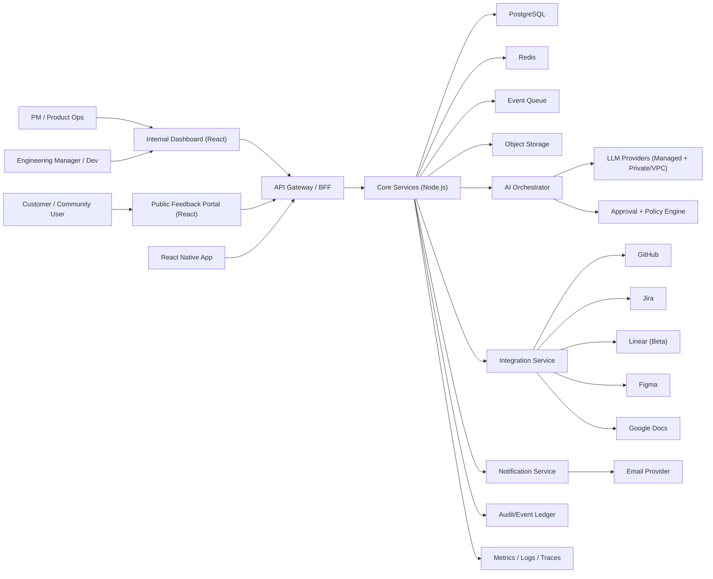

# CustomerVoice Architecture Spec (v1)

## 1. Purpose
This document defines the v1 technical architecture for CustomerVoice, aligned to these locked constraints:
- Global launch from day 1.
- Cloud-agnostic deployment baseline.
- Node.js backend, React web frontend, React Native mobile app.
- Local developer runtime with Docker Compose.
- Kubernetes cloud runtime.
- v1 multi-tenant SaaS, with single-tenant/VPC profile in phase 2.
- AI workflow with explicit human approvals by default.
- GoodHealth.ai and GoodWealth.ai integration through SSO and embedded view.

## 2. Architecture principles
1. Workflow-first architecture over tool-first architecture.
2. Default secure posture and full auditability for AI and admin actions.
3. Clear tenant isolation boundaries at data, secrets, and execution layers.
4. Integration depth over connector breadth in v1.
5. Provider abstraction for compute, storage, queue, and identity adapters.
6. Fast local reproducibility with environment parity to cloud where practical.

## 3. Scope and boundaries
## In scope (v1)
- Feedback portal and internal product dashboard.
- Voting, comments, status updates, search, dedupe, and merge.
- RICE and revenue potential scoring.
- AI draft generation for PRD, research summary, and implementation/test plan.
- Configurable approval policies and approval lists.
- Jira primary + Linear beta integrations.
- GitHub integration for branch/PR status linkage.
- Figma and Google Docs integrations.
- Release notification to upvoters/commenters.
- Beta tester group selection and invite workflow.
- White-label theme/logo.

## Out of scope (v1)
- Auto-deploy execution from CustomerVoice.
- Full custom domain and branded email white-label features.
- Phase-2 single-tenant/VPC deployment rollout.

## 4. High-level system context

## 5. Service decomposition
1. `gateway-service`
- AuthN/AuthZ entrypoint.
- Request shaping for web/mobile.
- Rate limiting and tenant-aware policy checks.

2. `identity-service`
- Supabase auth integration.
- Organization/workspace membership and role mapping.
- SSO and social login configuration.

3. `feedback-service`
- Boards, ideas, votes, comments, tags, statuses.
- Idea dedupe/merge.
- Public vs internal visibility rules.

4. `prioritization-service`
- RICE scoring.
- Revenue potential scoring.
- Segment impact summaries.

5. `workflow-service`
- Stage transitions.
- Gate rules and approval assignment.
- Workflow timeline and execution provenance.

6. `ai-orchestrator-service`
- Prompt template management.
- Model routing (managed vs private endpoint).
- Draft generation for PRD/research/plans.
- Output classification and risk tiering.

7. `integration-service`
- OAuth/app installation management.
- Connector sync jobs.
- Artifact linking across external systems.

8. `notification-service`
- Event-driven notifications.
- Audience targeting (upvoters, commenters, beta group).
- Template rendering and delivery state tracking.

9. `audit-compliance-service`
- Immutable event log.
- Exportable evidence for control testing.
- Policy decision and approval history.

10. `analytics-service`
- Activation, conversion, cycle-time, and adoption metrics.
- Workspace- and tenant-level dashboards.

## 6. Core data architecture
## Primary data store
- PostgreSQL for transactional entities.
- Row-level tenant partitioning plus tenant_id indexing.

## Cache and ephemeral state
- Redis for session cache, request throttling, and queue coordination.

## Event and async processing
- Queue abstraction with pluggable backend.
- Event types:
  - Domain events (idea created, vote added, status changed).
  - Workflow events (gate opened, approval granted, stage completed).
  - Integration events (PR linked, issue synced, docs updated).
  - Notification events (release notify queued/sent/failed).

## Object storage
- PRD artifacts, exports, and attachment content.
- Signed URL access with tenant policy checks.

## 7. Multitenancy and isolation model
1. Tenant-aware access middleware on every request.
2. Tenant-scoped encryption context for sensitive fields.
3. Connector secrets encrypted and logically isolated per workspace.
4. Data export and deletion scoped by tenant/workspace policy.
5. Future phase-2 profile:
   - single-tenant DB.
   - isolated runtime namespace/project/account.
   - optional customer-managed keys.

## 8. Identity and access model
1. Identity providers:
- Supabase auth (email/password, magic links, social Google).
- Enterprise SSO (SAML/OIDC).

2. Roles:
- `tenant_admin`
- `workspace_admin`
- `product_manager`
- `engineering_manager`
- `contributor`
- `viewer`

3. Approval governance:
- Configurable gate approver lists per workspace.
- Quorum rules (single approver, multi-approver, or role-based threshold).
- Override rules with elevated audit evidence.

## 9. AI architecture and controls
## Model support
1. Managed external LLM APIs.
2. Private model/VPC endpoint option from early stage.

## AI job flow
1. Workflow stage enters AI-enabled state.
2. Context builder composes prompt input from approved data sources.
3. Policy engine redacts restricted fields and validates allowed actions.
4. Model router selects endpoint per tenant policy and budget.
5. Output validator enforces structure and prohibited content checks.
6. Draft artifact persisted with provenance and model metadata.
7. Human approval required for external write actions by default.

## Risk tiers
1. Tier 0: summarize/read-only analysis.
2. Tier 1: draft document generation.
3. Tier 2: writes to external planning/design/docs tools.
4. Tier 3: SCM or deploy-adjacent actions.

## 10. Security and compliance-ready design
## Baseline security controls (v1)
1. TLS everywhere and encryption at rest.
2. WAF and API rate limits.
3. Secret manager integration and rotation policy.
4. MFA support for privileged roles.
5. Fine-grained RBAC and audit logs.
6. Dependency, container, IaC, and secret scanning in CI.

## Compliance-readiness controls
1. SOC 2:
- change management, access controls, logging, incident response evidence.
2. HIPAA readiness:
- PHI handling policy, minimum-necessary data in prompts, audit trail.
3. GDPR readiness:
- consent basis mapping, DSAR export/delete workflows, retention controls.
4. ISO 27001 readiness:
- control catalog mapping and evidence pipeline.
5. Additional readiness:
- CCPA/CPRA.
- WCAG 2.2 AA.
- India DPDP Act.
- NIST SSDF.
- EU AI Act governance evidence.

## 11. Deployment architecture
## Local (Docker Compose)
Services:
- `web`
- `api`
- `worker`
- `postgres`
- `redis`
- `mailhog`
- optional `minio`

## Cloud (Kubernetes)
Namespaces:
- `cv-prod`
- `cv-staging`
- `cv-dev`

Core components:
- ingress controller.
- API gateway.
- service deployments and HPA.
- managed DB/redis/object storage.
- centralized observability stack.

Cloud independence strategy:
- 12-factor configuration.
- provider adapters for storage, messaging, and secrets.
- Terraform module boundaries by provider.

## 12. Reliability and observability
## SLO targets (v1)
1. Public portal availability: 99.5%.
2. API p95 latency: < 400 ms for standard read operations.
3. Async workflow processing success: > 99%.
4. Notification delivery success (non-hard-bounce): > 98%.

## Observability stack
1. Structured logs with trace IDs.
2. Metrics for product and platform dimensions.
3. Distributed tracing across gateway, services, and integrations.
4. Alerting rules for error budgets, queue lag, and connector failures.

## 13. Failure handling and resilience
1. Idempotency keys for write endpoints.
2. Dead-letter queue with replay tooling.
3. Circuit breakers on external connectors and model endpoints.
4. Graceful degradation:
- if AI unavailable, manual workflows remain operational.
- if connector unavailable, queue retries and non-blocking user state.

## 14. Environment promotion strategy
1. `dev` -> `staging` -> `prod` with required checks.
2. Migration policy:
- forward-only migrations.
- rollback scripts for hotfix scenarios.
3. Release policy:
- feature flags for staged rollout.
- canary for integration-heavy features.

## 15. Phase 2 architecture extensions
1. Single-tenant/VPC deployment profile.
2. Custom domain + branded email pipeline for white-label.
3. Deployment trigger integration (currently status-only in v1).
4. Enhanced compliance automation and evidence exports.

## 16. Data residency policy (locked)
1. Default enabled deployment zone:
- US only at initial cloud launch.
2. Additional supported profiles:
- EU and India profiles are implemented as configurable zone options but remain disabled until explicitly enabled.
3. Expansion policy:
- New regions outside US/EU/India are introduced only via explicit new-zone rollout tied to country/company requirements.
4. Tenant routing behavior:
- Every tenant is pinned to one active residency zone.
- Cross-zone data movement requires approved migration workflow and audit log.
